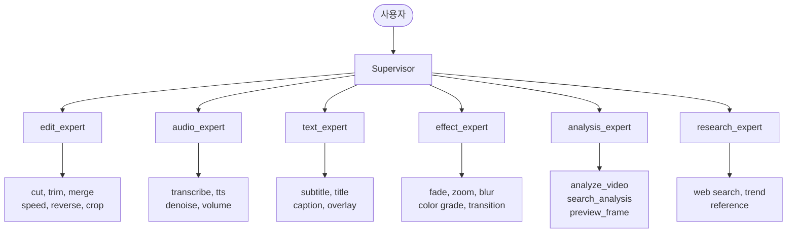

<p align="center">
  
  
  
  
  
</p>

<h1 align="center">Video Edit Agent</h1>

<p align="center">
  <b>자연어로 영상을 편집하는 AI 에이전트</b><br>
  "지루한 부분 빼줘", "해골 나오는 장면만 모아줘", "필러 다 잘라줘" — 말만 하면 알아서 편집합니다.
</p>

<p align="center">
  <a href="#architecture">아키텍처</a> · 
  <a href="#analysis-pipeline">분석 파이프라인</a> · 
  <a href="#what-it-can-do">가능한 편집 명령</a> · 
  <a href="#analysis-output">분석 결과 구조</a> · 
  <a href="#tools">도구 목록</a> · 
  <a href="#quickstart">시작하기</a> · 
  <a href="#api">API</a> · 
  <a href="#team">팀 구성</a> · 
  <a href="#roadmap">로드맵</a>
</p>

---

## 핵심 아이디어

기존 LangGraph 에이전트의 문제점: **노드와 엣지를 미리 정해놓으면 아무리 복잡해도 정적이다.** "분석 → 계획 → 실행 → 검증" 같은 고정 파이프라인은 예외 상황에 대응할 수 없다.

이 프로젝트의 접근: **Claude Code처럼 LLM이 매 턴 자유롭게 판단하는 ReAct 루프 + 전문화된 도구 세트.** 흐름은 그래프가 아니라 LLM의 추론이 결정한다.

```
while not done:
    action = llm.think(context + tool_results)
    result = execute(action.tool_call)
    context.append(result)
```

복잡한 그래프 대신 **도구를 풍부하게 만들고, LLM이 자유롭게 조합**하는 것이 핵심.

---

<h2 id="architecture">아키텍처</h2>

### 전체 구조

```
사용자: "지루한 부분 빼줘"
  │
  v
┌─────────────────────────────────────────────────────┐
│  Supervisor (라우팅)                                  │
│  "이건 분석 + 편집이 필요하다" → 적절한 Agent에 위임      │
└──────────────┬──────────────────────────────────────┘
               │
               v
┌─────────────────────────────────────────────────────┐
│  Expert Agent (ReAct Loop)                           │
│                                                      │
│  1. search_analysis("지루한 구간") → 후보 3개 발견      │
│  2. 생각: "두 번째는 핵심 내용이라 살려야겠다"            │
│  3. execute_edit([cut(55,72), cut(200,225)])          │
│  4. preview_frame(54.5) → 컷 직전 확인                │
│  5. preview_frame(72.1) → 컷 직후 확인                │
│  6. 생각: "연결 자연스럽다. 사용자에게 전달"              │
│                                                      │
│  → 순서가 미리 정해진 게 아니라 LLM이 상황 보고 판단      │
└─────────────────────────────────────────────────────┘
```

### Supervisor + Domain Expert 패턴



각 Expert Agent는 내부에 **독립적인 ReAct 루프**를 가진다. Supervisor가 "어느 전문가에게 맡길지"만 판단하면, 그 안에서는 LLM이 자유롭게 도구를 조합한다.

> Claude Code와의 대응:
> | Claude Code | Video Edit Agent |
> |---|---|
> | `Read` (코드 읽기) | `search_analysis` (분석 JSON 검색) |
> | `Grep` (패턴 검색) | `words`/`segments`/`objects`에서 키워드 매칭 |
> | `Edit` (코드 수정) | `execute_edit` (FFmpeg 편집 실행) |
> | `Bash: npm test` (검증) | `preview_frame` (결과 프레임 추출 → 시각 확인) |
> | 재시도 | LLM이 자연스럽게 "컷 포인트 수정해야겠다" 판단 → 도구 재호출 |

---

<h2 id="analysis-pipeline">분석 파이프라인</h2>

영상이 입력되면 **4개 엔진이 병렬**로 분석하고, 결과를 타임스탬프 기준으로 합친다.

```
영상 입력 (reference1.mp4, 14분 45초)
    │
    ├── Whisper API ──────── 단어 단위 타임코드 (351개 단어, ms 정밀도)
    │                        "멕시코" → 3.94s ~ 4.38s
    │
    ├── Gemini 2.5 Flash ─── 영상 통째로 업로드 → 씬/행동/감정/에너지 분석
    │                        37개 씬, 20명 등장인물, 6개 하이라이트
    │
    ├── FFmpeg ──────────── 침묵 감지 + 구간별 볼륨 프로필
    │                        85개 볼륨 측정점
    │
    └── Claude Vision ────── Gemini가 잡은 씬별 키프레임 상세 분석
                             24개 씬에 객체/제스처/표정/환경 디테일 추가
```

### 왜 4개가 필요한가?

| 엔진 | 역할 | 잘하는 것 | 못하는 것 |
|------|------|----------|----------|
| **Whisper** | 음성 → 텍스트 | 단어별 ms 타임코드 | 시각 정보 |
| **Gemini** | 영상 전체 이해 | 씬 경계, 흐름, 구조 | 프레임 디테일 |
| **Claude** | 프레임 정밀 분석 | 객체 위치, 제스처, 표정 | 영상 전체 흐름 |
| **FFmpeg** | 오디오 신호 | 침묵/볼륨 수치 데이터 | 의미 이해 |

Gemini는 "이 씬에 차가 있다" 정도, Claude는 "운전자가 오른손을 운전대에 올려놓고 있고, 내비게이션에 파란색 화면이 표시 중"까지 잡는다.

### 실제 분석 시간 (15분 영상 기준)

| 단계 | 소요 시간 | 비용 |
|------|----------|------|
| Whisper API | ~15초 | ~$0.09 |
| Gemini 업로드 + 분석 | ~3분 | ~$0.05 |
| FFmpeg 침묵/볼륨 | ~10초 | 무료 |
| Claude Vision (24프레임) | ~8분 | ~$0.15 |
| **합계** | **~12분** | **~$0.29** |

---

<h2 id="what-it-can-do">가능한 편집 명령</h2>

분석 JSON 하나로 에이전트가 처리할 수 있는 명령들:

### 텍스트 기반 검색

```
"멕시코 시장 얘기하는 부분 잘라줘"
  → words에서 "멕시코", "시장" 검색 → 타임스탬프 → cut

"'잘생겨지는 약' 말한 부분만 뽑아줘"
  → words에서 정확한 단어 매칭 → 해당 구간 추출

"어, 음 같은 필러 다 잘라줘"
  → events.fillers 배열 그대로 → 각 구간 cut

"자막 넣어줘"
  → segments의 text + start/end → SRT 생성
```

### 시각 기반 검색

```
"차 타고 있는 부분만"
  → scenes에서 visual_tags에 "car" 필터

"해골 나오는 부분"
  → claude_detail.objects_detailed에서 "해골" 검색

"손짓하는 부분 찾아줘"
  → claude_detail.people_detailed.gesture에서 검색

"시장 내부 장면만 모아줘"
  → claude_detail.environment.location_type에서 "시장" 검색

"화면에 가격표 나오는 부분"
  → claude_detail.text_in_frame 검색
```

### 분위기/편집 판단

```
"지루한 부분 빼줘"
  → boring_candidates + energy 낮은 구간 + pace:very_slow 조합

"하이라이트만 모아줘"
  → highlight_candidates 사용

"느린 부분 1.5배속으로"
  → speech_pace에서 pace:very_slow/slow 구간 → speed up

"조용한 부분 잘라줘"
  → events.silences + volume_profile에서 mean_db 낮은 구간
```

### 사람 기반 검색

```
"메인 화자가 말하는 부분만"
  → scenes.people에서 speaking == true 필터

"웃는 장면만 모아줘"
  → scenes.people에서 emotion == "happy" 필터
```

---

<h2 id="analysis-output">분석 결과 구조</h2>

`analyze_video` 실행 시 생성되는 JSON의 전체 구조:

```
analysis.json
│
├── metadata ────────────── 영상 기본 정보
│   { duration: 885.3, resolution: "1920x1080", fps: 29.97, codec: "h264" }
│
├── words [351] ─────────── Whisper: 단어별 타임코드
│   { word: "멕시코", start: 3.94, end: 4.38 }
│
├── segments [163] ──────── Whisper 문장 + Gemini 시각 정보 매칭
│   { text: "멕시코 시티입니다", start: 2.76, end: 6.0,
│     scene_id: 2, visual_tags: ["car"], energy: 0.7, pacing: "normal" }
│
├── scenes [37] ─────────── Gemini 씬 분석 + Claude Vision 상세
│   ├── Gemini: id, start, end, summary, content_type, visual_tags,
│   │          objects, people, actions, shot_type, camera_movement,
│   │          energy, pacing, edit_notes
│   └── claude_detail: description, objects_detailed, people_detailed,
│                      environment, text_in_frame, mood, edit_relevance
│
├── people_index [20] ───── 등장인물 목록
│   { label: "P1", description: "빨간/검은색 셔츠 남성", first_appearance: 0.0 }
│
├── key_moments [6] ─────── 편집 핵심 포인트
│   { start: 104.3, type: "funny", reason: "'잘생겨지는 약' 코믹 상황" }
│
├── highlight_candidates ── 살려야 할 구간
├── boring_candidates ───── 잘라도 되는 구간
│
├── events
│   ├── fillers [13] ─────── 필러 단어 ("어", "음", "좀")
│   └── silences ─────────── 침묵 구간
│
├── speech_pace [37] ─────── 구간별 말하기 속도 (WPM)
│   { start: 0.0, end: 10.0, wpm: 66.0, pace: "very_slow" }
│
├── volume_profile [85] ──── 구간별 볼륨 (dB)
│   { start: 0.0, end: 5.0, mean_db: -19.4, peak_db: -9.6 }
│
└── visual_flow ──────────── 영상 전체 구조
    { overall_structure: "인트로-시장탐방-이발-아웃트로",
      transitions: [...], repetitive_sections: [...] }
```

### 분석 결과 예시 (실제 데이터)

<details>
<summary>Scene 1 — Gemini + Claude Vision 합친 결과</summary>

```json
{
  "id": 1,
  "start": 0.0,
  "end": 3.2,
  "summary": "멕시코시티의 차 안에서 영상이 시작",
  "content_type": "other",
  "visual_tags": ["person_talking", "indoor", "car", "driving"],
  "objects": ["운전대", "내비게이션", "백미러"],
  "people": [{
    "label": "P1",
    "description": "남성, 검은색과 빨간색 유니폼",
    "speaking": true,
    "emotion": "neutral",
    "body_language": "운전"
  }],
  "energy": 0.5,
  "edit_notes": "도입부, 멕시코시티 소개",
  "claude_detail": {
    "description": "차량 뒷좌석에서 촬영된 장면으로, 운전자의 뒷모습이 보인다. 차 앞 유리 너머로 밝은 햇살과 나무가 보이며 멕시코시티 도심을 주행 중이다.",
    "objects_detailed": [
      { "name": "운전대", "position": "화면 좌측 중앙", "notable": "운전자가 손을 올려놓고 있음" },
      { "name": "내비게이션(핸드폰)", "position": "앞유리 아래 거치대", "notable": "파란색 화면 표시 중" },
      { "name": "백미러", "position": "화면 중앙 상단", "notable": "반사광 있음" }
    ],
    "people_detailed": [{
      "label": "P1",
      "appearance": "빨간/검은색 체크 셔츠, 짧은 머리 남성",
      "gesture": "오른손을 운전대에 올려놓고 있음",
      "gaze_direction": "전방 도로"
    }],
    "environment": {
      "location_type": "차량 내부 (이동 중)",
      "location_detail": "멕시코시티 도심 도로, 밝은 낮 햇살이 앞 유리로 들어옴",
      "weather": "맑음"
    },
    "mood": "잔잔하고 평온한 도입부 분위기"
  }
}
```
</details>

---

<h2 id="tools">도구 목록</h2>

### 구현 완료

| 도구 | 파일 | 설명 | 담당 |
|------|------|------|------|
| `analyze_video` | `analyze.py` | 4-파이프라인 영상 종합 분석 (Whisper + Gemini + Claude + FFmpeg) | 성민 |
| `cut_video` | `cut.py` | FFmpeg 기반 영상 구간 자르기 (stream copy) | 병건 |
| `cut_scene` | `cut.py` | 씬 이름으로 자르기 (SCENE_MAP 기반) | 병건 |
| `transcribe_video` | `transcribe.py` | OpenAI Whisper API 자막 추출 (segment 단위) | 은서 |
| `text_to_speech` | `tts.py` | Edge-TTS 텍스트 음성 변환 (한국어) | 은채 |
| `search_scene` | `scene.py` | 시맨틱 씬 검색 (더미) | - |
| `get_video_info` | `scene.py` | 영상 메타데이터 조회 (더미) | - |

### 구현 예정

| 도구 | 용도 | 우선순위 |
|------|------|---------|
| `search_analysis` | 분석 JSON을 자연어로 검색 | P1 |
| `execute_edit` | 편집 명령 DSL → FFmpeg 실행 | P1 |
| `preview_frame` | 결과 영상에서 특정 시점 프레임 추출 | P1 |
| `compare_before_after` | 원본 vs 편집본 프레임 비교 | P2 |
| `merge_clips` | 여러 클립 합치기 | P2 |
| `add_subtitle` | SRT/ASS 자막 삽입 | P2 |
| `adjust_speed` | 구간 속도 변경 | P2 |
| `add_bgm` | 배경음악 삽입 | P3 |
| `add_transition` | 전환 효과 (fade, dissolve 등) | P3 |
| `color_grade` | 색보정 (LUT 적용) | P3 |

---

### 편집 상태 버전 관리

편집할 때마다 분석 JSON이 **버전 단위로 갱신**된다. 에이전트는 항상 최신 버전을 참조해서 "지금 영상이 어떤 상태인지" 알고 다음 편집을 판단한다.

```
reference1_analysis.json       ← 원본 분석 (v0)
reference1_analysis_v1.json    ← 필러 제거 후
reference1_analysis_v2.json    ← 지루한 구간 컷 후
reference1_analysis_v3.json    ← 속도 조정 후
```

각 버전에는 `edit_history`가 누적되어 "어떤 편집을 거쳤는지" 추적 가능:
```json
{
  "edit_history": [
    { "version": 1, "action": "cut_fillers", "removed_count": 13 },
    { "version": 2, "action": "cut_boring", "removed_segments": [{"start": 55, "end": 72}] }
  ],
  "timestamp_offset_map": { ... }
}
```

---

<h2 id="quickstart">시작하기</h2>

### 요구 사항

- Python 3.10+
- FFmpeg (시스템에 설치)
- API 키: Google AI (Gemini), OpenAI (Whisper), Anthropic (Claude Vision, 선택)

### 설치

```bash
git clone https://github.com/2026-1-prometheus-4-team/video-agent-study.git
cd video-agent-study

python3 -m venv venv
source venv/bin/activate
pip install -r requirements.txt
pip install google-genai openai anthropic   # 분석 파이프라인용
```

### 환경 변수

```bash
# .env
GOOGLE_API_KEY=your_gemini_key
OPENAI_API_KEY=your_openai_key
ANTHROPIC_API_KEY=your_anthropic_key    # 선택 — 없으면 Claude Vision만 스킵
```

### 영상 분석 테스트

```bash
# videos/ 폴더에 영상 넣고
venv/bin/python -c "
import sys, os
sys.path.insert(0, '.')
from agent.tools.analyze import analyze_video
result = analyze_video.invoke({'file_path': os.path.abspath('videos/sample.mp4')})
print(result)
"
```

### 서버 실행

```bash
python server.py
# Swagger UI: http://localhost:8000/docs
```

---

<h2 id="api">API</h2>

### 세션 기반 (연속 대화)

| Method | Endpoint | 설명 |
|--------|----------|------|
| `POST` | `/session` | 새 세션 생성 (video_context 포함 가능) |
| `POST` | `/chat` | session_id + message로 대화 |
| `GET` | `/session/{id}` | 세션 정보 조회 |
| `DELETE` | `/session/{id}` | 세션 종료 |

### 단발 실행

| Method | Endpoint | 설명 |
|--------|----------|------|
| `POST` | `/edit` | video_context + user_input 한 번에 실행 |

### WebSocket 스트리밍

```
WS /ws/chat/{session_id}

전송: {"message": "3초에서 7초 잘라줘"}
수신: {"type": "message"|"tool_call"|"done", ...}
```

---

<h2 id="project-structure">프로젝트 구조</h2>

```
video-agent-study/
├── agent/
│   ├── __init__.py             패키지 export
│   ├── state.py                VideoContext, Scene, Transcript 스키마
│   ├── llm.py                  Gemini 2.5 Flash 인스턴스
│   ├── graph.py                Supervisor + 6 Sub-Agent 그래프
│   └── tools/
│       ├── __init__.py         도구 자동 수집 + 도메인별 그룹 (tool_groups)
│       ├── analyze.py          4-파이프라인 영상 종합 분석 (Whisper+Gemini+Claude+FFmpeg)
│       ├── cut.py              FFmpeg 영상 자르기
│       ├── transcribe.py       OpenAI Whisper 자막 추출
│       ├── tts.py              Edge-TTS 음성 합성
│       └── scene.py            시맨틱 씬 검색 (더미)
├── server.py                   FastAPI 서버 (REST + WebSocket)
├── main.py                     CLI 엔트리포인트
├── videos/                     영상 파일 (gitignore)
├── docs/
│   └── architecture-gaps.md    아키텍처 개선 과제 6개
├── requirements.txt
├── CLAUDE.md                   프로젝트 규칙 + 팀 운영
├── SETUP.md                    Git 브랜치 전략 + 로컬 셋업
└── .env                        API 키 (gitignore)
```

---

<h2 id="tech-stack">기술 스택</h2>

| 영역 | 기술 | 용도 |
|------|------|------|
| Agent Framework | LangGraph + langgraph-supervisor | 멀티 에이전트 오케스트레이션 |
| LLM (메인) | Gemini 2.5 Flash | Supervisor + Sub-Agent 추론 |
| 영상 분석 (전체) | Gemini 2.5 Flash Files API | 씬 분리, 행동/감정/에너지 분석 |
| 영상 분석 (디테일) | Claude Sonnet 4.6 Vision | 키프레임별 객체/제스처/환경 정밀 분석 |
| 음성 인식 | OpenAI Whisper API | 단어 단위 타임코드 + 문장 분리 |
| 음성 합성 | Edge-TTS (Microsoft) | 한국어 TTS |
| 영상 편집 | FFmpeg | cut, merge, speed, subtitle 등 |
| 오디오 분석 | FFmpeg (silencedetect, volumedetect) | 침묵 감지, 볼륨 프로필 |
| 서버 | FastAPI + WebSocket | REST API + 실시간 스트리밍 |
| 벡터 DB (예정) | Qdrant | 시맨틱 씬 검색 |

---

<h2 id="team">팀 구성</h2>

> Prometheus 2026-1 4팀

| 이름 | 역할 | 담당 영역 |
|------|------|----------|
| 성민 (리더) | 아키텍처 + 분석 파이프라인 | LangGraph 설계, analyze.py, graph.py, Next.js UI |
| 병건 | 편집 도구 | FFmpeg 기반 cut/merge/speed 도구 |
| 은서 | 음성 처리 | Whisper 자막 추출, 오디오 파이프라인 |
| 은채 | 텍스트/음성 | TTS 합성, 자막 삽입 |

### 새 도구 추가하는 법

```python
# 1. agent/tools/내이름.py 생성
from langchain_core.tools import tool

@tool
def my_tool(param: str) -> str:
    """도구 설명 (LLM이 이걸 보고 호출 판단)"""
    # 구현
    return result

TOOLS = [my_tool]

# 2. agent/tools/__init__.py에 등록
from agent.tools.내이름 import TOOLS as my_tools
tool_groups["edit"].extend(my_tools)  # 해당 도메인에 추가
```

---

<h2 id="roadmap">로드맵</h2>

### Phase 1 — 분석 파이프라인 (완료)

- [x] Whisper API 단어 단위 타임코드
- [x] Gemini 2.5 Flash 영상 전체 분석 (씬/행동/감정/에너지)
- [x] Claude Vision 키프레임 상세 분석 (객체/제스처/환경)
- [x] FFmpeg 침묵 감지 + 볼륨 프로필
- [x] 4개 엔진 병렬 실행 + 타임스탬프 매칭
- [x] Whisper segments + Gemini scenes 교차 매칭

### Phase 2 — 편집 실행 계층 (진행 중)

- [x] FFmpeg cut (기본 구간 자르기)
- [ ] 편집 명령 DSL 정의 (에이전트 출력 포맷)
- [ ] DSL → FFmpeg 변환기
- [ ] 편집 상태 버전 관리 (analysis_v1.json → v2 → v3)
- [ ] preview_frame (결과 검증 도구)
- [ ] compare_before_after (원본 vs 편집본)

### Phase 3 — 시맨틱 검색 + 고급 편집

- [ ] Qdrant 벡터 DB 연동 (의미 기반 씬 검색)
- [ ] 화자 분리 (speaker diarization)
- [ ] merge_clips, add_subtitle, adjust_speed
- [ ] 전환 효과 (fade, dissolve, zoom)

### Phase 4 — 프론트엔드 + 사용자 경험

- [ ] Next.js 타임라인 UI
- [ ] 실시간 편집 미리보기
- [ ] 사용자 피드백 루프 (interrupt + approval)
- [ ] 편집 히스토리 시각화

---

<h2 id="license">라이선스</h2>

이 프로젝트는 고려대학교 정보대학 Prometheus 스터디 그룹의 학습 목적 프로젝트입니다.
