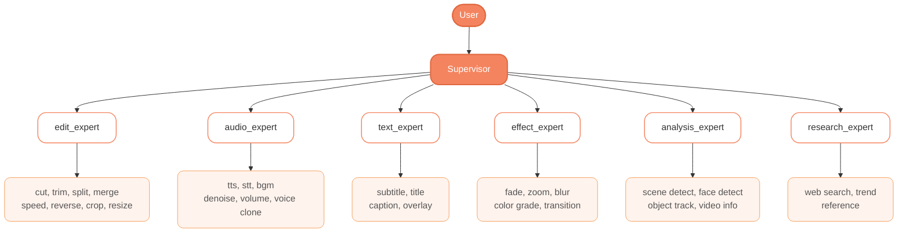
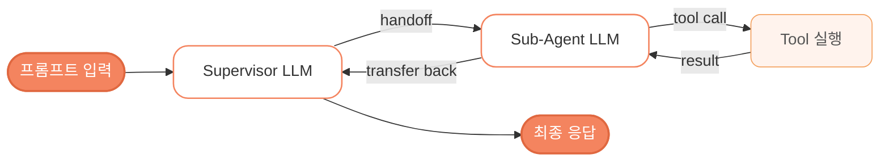

# 2회차 스터디 - Supervisor + Sub-Agent 아키텍처

## 아키텍처



각 Sub-Agent는 `create_agent`로 생성되며 내부에 ReAct 루프가 내장되어 있음.
Supervisor는 `langgraph-supervisor`의 `create_supervisor`로 생성, handoff tool을 자동 생성함.

### 요청 처리 흐름



## 파일 구조

```text
agent/
  __init__.py        패키지 export
  state.py           VideoContext 등 도메인 스키마
  llm.py             Gemini LLM 인스턴스
  graph.py           Supervisor + Sub-Agent 그래프 정의
  tools/
    __init__.py      tool 자동 수집 + 도메인별 그룹 (tool_groups)
    scene.py         search_scene, get_video_info (더미)
    cut.py           영상 자르기 Tool (더미)
    transcribe.py    음성 -> 자막 Tool (더미)
    tts.py           텍스트 -> 음성 Tool (더미)
server.py            FastAPI 서버 (세션 기반 REST + WebSocket)
requirements.txt
```

## 팀원 작업 분담

각자 본인 파일만 수정하면 머지 충돌 없음.

| 담당  | 작업                              | 건드릴 파일                   |
| ----- | --------------------------------- | ----------------------------- |
| 성민  | Supervisor + graph 설계           | `agent/graph.py`, `server.py` |
| 병건  | 타임스탬프 받아서 영상 자르는 Tool| `agent/tools/cut.py`          |
| 은서  | faster-whisper 자막 + 타임스탬프  | `agent/tools/transcribe.py`   |
| 은채  | 텍스트 -> 음성 TTS                | `agent/tools/tts.py`          |

### 건드리지 말 것 (공용)

- `agent/state.py` - 도메인 스키마, 모든 모듈이 import 함
- `agent/llm.py` - LLM 인스턴스
- `agent/graph.py` - Supervisor 구조 (성민 담당)

### 가끔 같이 건드림 (PR 머지 시 주의)

- `agent/tools/__init__.py` - 새 tool 추가 시 import + tool_groups 등록

### 새 Tool 추가하는 법

1. `agent/tools/내이름.py` 생성
2. `@tool` 데코레이터로 함수 정의 (docstring 자세히 - LLM이 이걸로 판단함)
3. 파일 마지막에 `TOOLS = [내함수1, 내함수2]` 노출
4. `agent/tools/__init__.py` 에 import 한 줄 + `tool_groups`에 해당 도메인에 등록

`agent/tools/scene.py` 가 살아있는 예시.

## 설치 및 실행

### 1. 가상환경 생성 및 패키지 설치

```bash
python3 -m venv venv
source venv/bin/activate          # Windows: venv\Scripts\activate
pip install -r requirements.txt
```

### 2. API 키 설정

Google AI Studio 에서 API 키 발급 : [aistudio.google.com/apikey](https://aistudio.google.com/apikey)

프로젝트 루트에 `.env` 파일 생성 후 아래 내용 작성

```text
GOOGLE_API_KEY=발급받은_키
```

### 3. 실행

```bash
# FastAPI 서버 실행
python server.py
# Swagger UI: http://localhost:8000/docs
```

## API 엔드포인트

### 세션 기반 (연속 대화)

```text
POST   /session          - 새 세션 생성 (video_context 넘기면 이후 자동 참조)
POST   /chat             - session_id + message 로 대화 (이력 유지)
GET    /session/{id}     - 세션 정보 조회
DELETE /session/{id}     - 세션 종료
```

### 단발성 (테스트용)

```text
POST   /edit             - video_context + user_input 한 번에 실행
```

### WebSocket (프론트엔드 스트리밍)

```text
WS     /ws/chat/{session_id}  - 실시간 스트리밍
       전송: {"message": "3초에서 7초 잘라줘"}
       수신: {"type": "message"|"tool_call"|"done", ...}
```

## 사용 기술

- LangGraph 1.1+ (`create_agent` - 내장 ReAct 루프)
- langgraph-supervisor (`create_supervisor` - handoff 기반 multi-agent)
- Gemini 2.5 Flash (LLM)
- FastAPI + MemorySaver (세션 기반 대화 유지)

## 성민 작업 내역 (2회차)

- 기존 수동 ReAct 루프를 `create_agent` + `create_supervisor`로 교체
- 6개 도메인 sub-agent 구조 설계 (edit, audio, text, effect, analysis, research)
- `tool_groups` 딕셔너리로 agent별 tool 그룹 분리
- 세션 기반 API 설계 (MemorySaver로 대화 이력 유지)
- video_context를 supervisor + 모든 sub-agent에 동적 주입

## 숙제

각자 본인 tool 파일의 더미 구현을 실제로 교체해서 PR.

- 병건: `cut.py` - FFmpeg subprocess로 실제 영상 cut
- 은서: `transcribe.py` - faster-whisper로 실제 자막 추출
- 은채: `tts.py` - TTS 엔진 연동 (ElevenLabs / OpenAI TTS 등)
